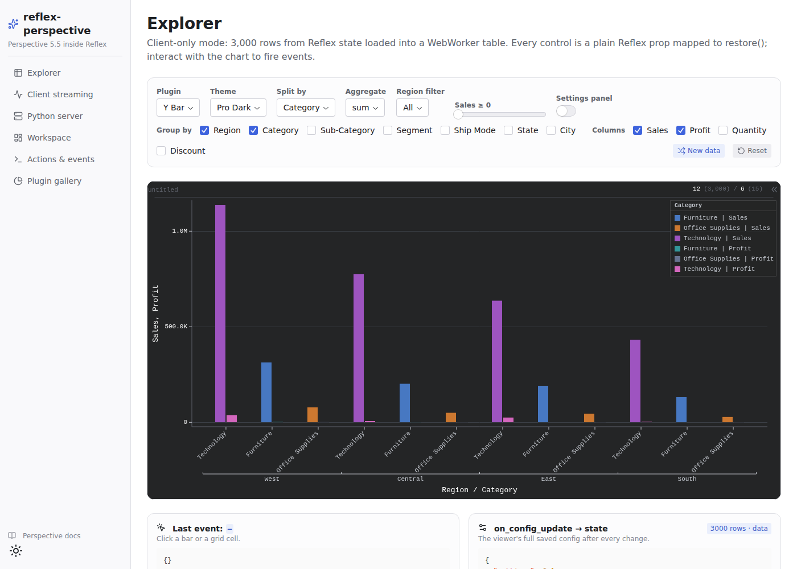
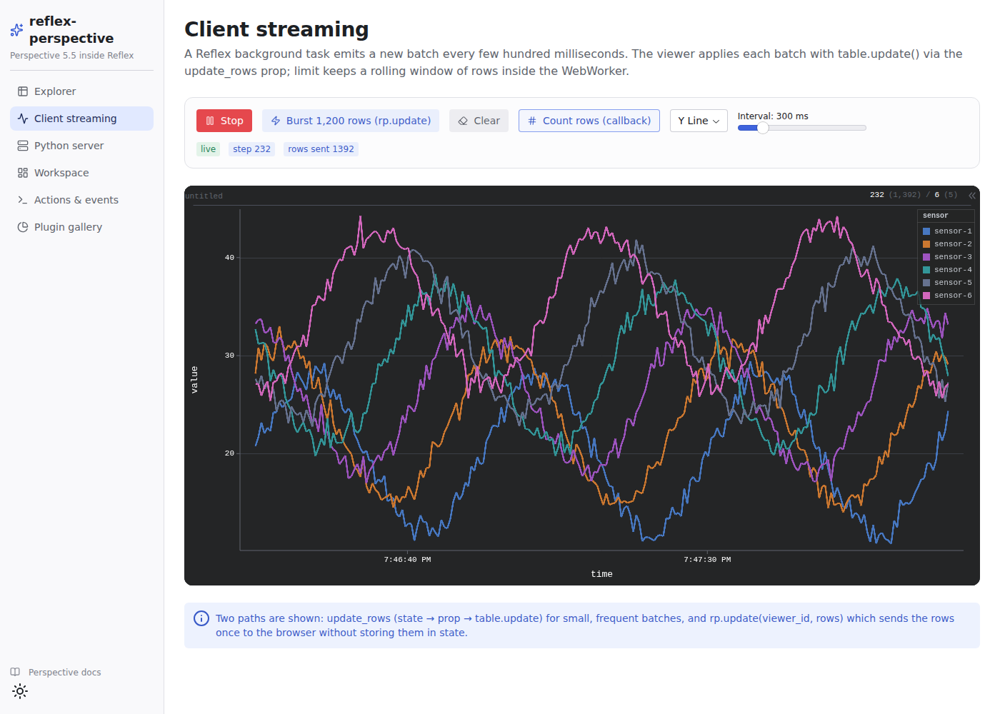
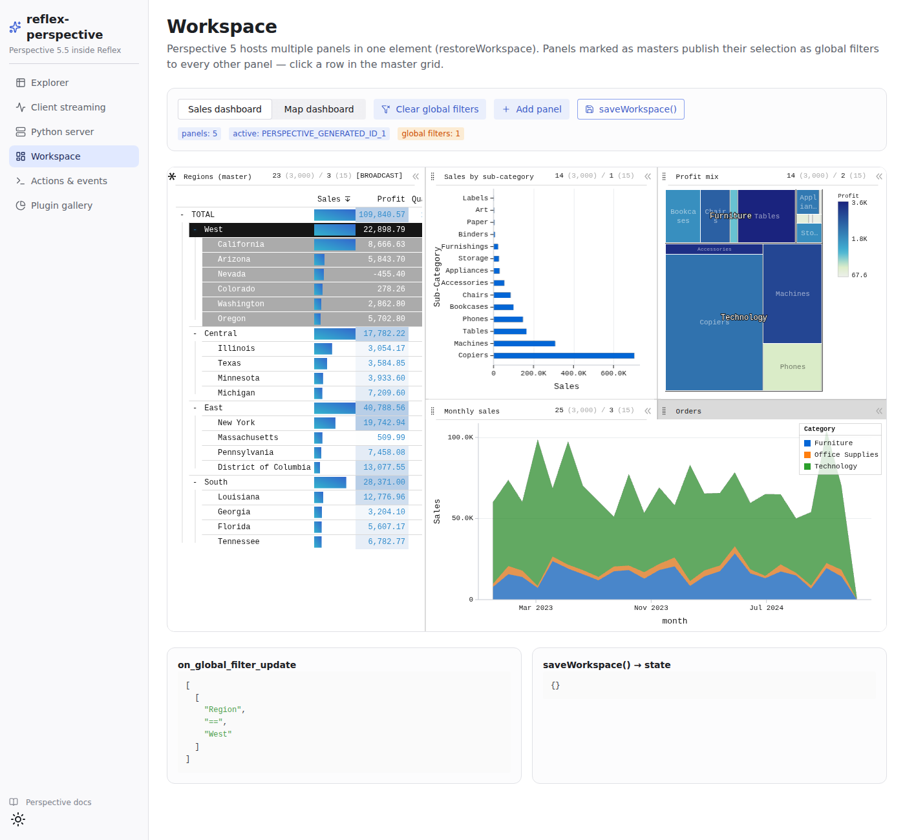
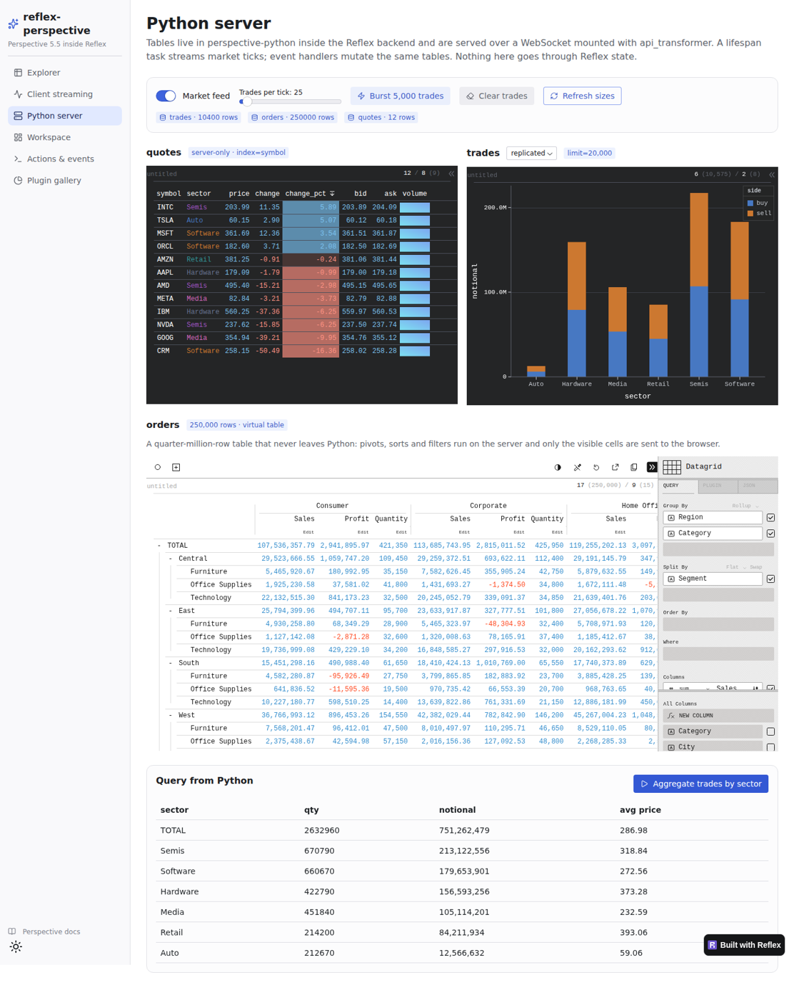
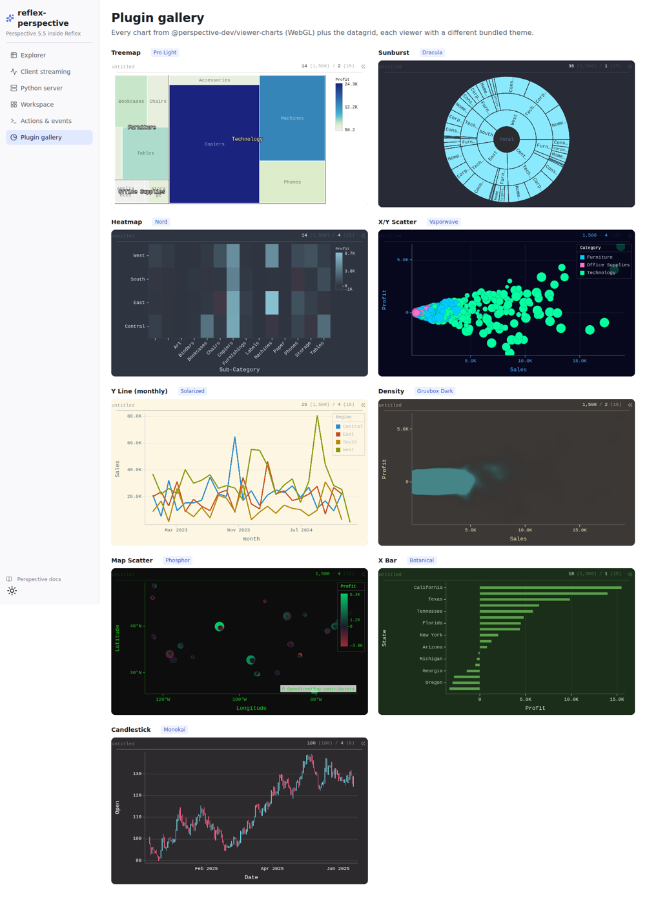

# reflex-perspective

A [Reflex](https://reflex.dev) custom component for [Perspective](https://perspective-dev.github.io) —
the WebAssembly analytics engine and interactive viewer (datagrid + WebGL charts) built for
large and streaming datasets.



- **All three Perspective data architectures**
  - *Client-only*: data from Reflex state, a URL (CSV / JSON / NDJSON / Arrow) or a schema lives in a browser WebWorker.
  - *Server-only (virtual)*: tables live in `perspective-python` **inside the Reflex backend**; only the visible cells cross the wire.
  - *Client/server replicated*: the browser keeps a live copy of a server table and computes views locally.
- **Declarative props** for the whole `ViewerConfig` (`plugin`, `group_by`, `split_by`, `columns`, `filter`, `sort`, `expressions`, `aggregates`, `columns_config`, `theme`, `settings`, ...) mapped to `restore()`.
- **Multi-panel workspaces** (`restoreWorkspace`) with master panels and global cross-filters.
- **Streaming** through props (`update_rows`, `remove_keys`) or straight from event handlers (`rp.update`).
- **Perspective Custom Events as Reflex events**: `on_click`, `on_select`, `on_config_update`, `on_global_filter_update`, `on_layout_update`, `on_load`, `on_error`, ...
- **Imperative API from Python**: `rp.save`, `rp.restore`, `rp.download`, `rp.copy`, `rp.export`, `rp.reset`, `rp.toggle_config`, `rp.update`, `rp.remove`, `rp.clear`, `rp.add_panel`, ...
- All 16 bundled themes, every datagrid and chart plugin (X/Y Bar, Line, Area, Scatter, Density, Treemap, Sunburst, Heatmap, Candlestick, OHLC, Map Scatter/Line/Density).
- SSR-safe lazy WASM bootstrap, automatic WebSocket reconnection, works in `reflex run` dev and `--env prod`.

Built against **Reflex 0.9.12** and **Perspective 5.5.1** (`@perspective-dev/*` npm packages and `perspective-python`).

## Installation

```bash
pip install reflex-perspective            # client-only mode
pip install "reflex-perspective[server]"  # + perspective-python for server modes
```

The npm packages are installed by Reflex automatically on the first `reflex run`.
The client-only component works on Python 3.10+; the `server` extra needs Python 3.11+
(`perspective-python` 5.x only publishes `cp311-abi3` wheels).

## Quick start (client-only)

```python
import reflex as rx
import reflex_perspective as rp


class State(rx.State):
    rows: list[dict] = [
        {"region": "East", "product": "A", "sales": 120.5},
        {"region": "West", "product": "B", "sales": 98.1},
    ]
    plugin: str = "Y Bar"

    @rx.event
    def clicked(self, detail: dict):
        print(detail["row"], detail["config"]["filter"])


def index():
    return rp.perspective_viewer(
        id="sales",
        data=State.rows,  # list of rows, dict of columns, or CSV text
        plugin=State.plugin,
        group_by=["region"],
        split_by=["product"],
        columns=["sales"],
        theme="Pro Dark",
        on_click=State.clicked,
        height="500px",
    )


app = rx.App()
app.add_page(index)
```

Changing any prop re-applies only the difference with `restore()`; changing `data` calls
`table.replace()` and keeps the user's view.

## Server-hosted tables (perspective-python)

```python
import reflex as rx
import reflex_perspective as rp
from reflex_perspective import server as ps

hub = ps.get_hub()  # a perspective.Server + local client
hub.table(big_dataframe, name="orders", index="order_id")

app = rx.App(api_transformer=ps.perspective_api())  # WebSocket at /perspective
# or: ps.mount(app)  (keeps any existing api_transformer)


def page():
    return rx.hstack(
        # virtual: pivots/sorts run in Python, only the viewport is sent
        rp.perspective_viewer(server_url="/perspective", server_table="orders"),
        # replicated: the browser keeps a synced copy and computes locally
        rp.perspective_viewer(
            server_url="/perspective", server_table="orders", server_mode="replicated"
        ),
    )


class State(rx.State):
    @rx.event
    def add_order(self):
        hub.update("orders", [{"order_id": 42, "qty": 3}])  # every viewer updates
```

`server_url` may be a path (resolved against the Reflex backend URL, which also handles
the dev setup where frontend and backend run on different ports) or an absolute `ws://` URL
of any Perspective server. Feed tables from background tasks, lifespan tasks
(`ps.run_periodically(fn, interval)`) or plain threads — the hub is thread-safe and the
WebSocket handler marshals messages back onto the event loop. Engine requests run in the
event loop's default thread pool (pass `executor=` to `perspective_api()` / `mount()` to use
your own), so a heavy pivot on a large table never blocks other Reflex events.

The endpoint checks the browser `Origin` header against Reflex's `cors_allowed_origins`
(or `allowed_origins=[...]` passed to `perspective_api()` / `mount()`), closing foreign
connections with code 1008. Set explicit origins in production: the Reflex default (`"*"`)
lets any site open the socket, and hosted tables are writable over it.

`PerspectiveHub` helpers: `table()`, `get_table()`, `has_table()`, `table_names()`,
`update()`, `remove()`, `clear()`, `size()`, `query(name, **view_config)` and
`delete_table()`.

## Streaming

```python
rp.perspective_viewer(
    id="ticks",
    schema={"time": "datetime", "symbol": "string", "price": "float"},
    limit=5000,  # rolling window
    update_rows=State.batch,  # every new list is applied with table.update()
    plugin="Y Line",
    group_by=["time"],
    split_by=["symbol"],
    columns=["price"],
)


# or push rows without storing them in state:
@rx.event
def burst(self):
    return rp.update("ticks", rows)
```

## Workspaces

```python
rp.perspective_viewer(
    data=State.rows,
    workspace={
        "masters": ["regions"],  # selections here become global filters
        "layout": {
            "type": "split-layout",
            "orientation": "horizontal",
            "sizes": [0.4, 0.6],
            "children": [
                {"type": "tab-layout", "tabs": ["regions"]},
                {"type": "tab-layout", "tabs": ["chart"]},
            ],
        },
        "panels": {
            "regions": {
                "plugin": "Datagrid",
                "group_by": ["Region"],
                "columns": ["Sales"],
            },
            "chart": {
                "plugin": "Treemap",
                "group_by": ["Category"],
                "columns": ["Sales"],
            },
        },
    },
    on_global_filter_update=State.set_filters,
)
```

Panels without a `table` in the `workspace` prop are bound to the viewer's own table
automatically. `rp.restore_workspace()` and `rp.add_panel()` pass their config through
unchanged, so include `table` there.

## Props

| Prop | Description |
| --- | --- |
| `data` | Rows (`list[dict]`), columns (`dict[str, list]`) or CSV text. |
| `schema` | `{"col": "string" \| "integer" \| "float" \| "boolean" \| "date" \| "datetime"}`; enforces types. |
| `index` / `limit` | Primary key (upserts) or rolling row limit. |
| `table_name` | Table name (defaults to the component `id`); saved configs reference it. |
| `url`, `url_format` | Load CSV / JSON / NDJSON / Arrow from a URL. |
| `server_url`, `server_table`, `server_mode` | Connect to a Perspective WebSocket server (`"server"` or `"replicated"`). |
| `update_rows`, `remove_keys` | Streaming: applied every time the prop changes. |
| `config` | Full `ViewerConfigUpdate`; the shortcut props below are merged on top. |
| `plugin`, `columns`, `group_by`, `split_by`, `filter`, `filter_op`, `sort`, `expressions`, `aggregates`, `group_by_depth`, `group_rollup_mode`, `split_rollup_mode`, `plugin_config`, `columns_config`, `theme`, `title`, `settings` | View configuration. |
| `edit_mode` | Datagrid mode: `READ_ONLY`, `EDIT`, `SELECT_ROW`, `SELECT_COLUMN`, `SELECT_REGION`, `SELECT_ROW_TREE`. |
| `workspace` | Multi-panel `WorkspaceConfigUpdate`. |
| `auto_size`, `auto_pause`, `throttle`, `plugin_limits` | Render policy. |

Styling props (`height`, `width`, `border_radius`, ...) apply to the `<perspective-viewer>` element (default height 600px).

## Events

| Event | Payload |
| --- | --- |
| `on_load` | `{"table", "schema", "num_rows", "source"}` |
| `on_config_update` | Full saved viewer config after any change |
| `on_click` | `{"row", "column_names", "config", "panel"}` (`config.filter` selects the clicked datum) |
| `on_select` | `{"selected", "row", "column_names", "insert_filters", "remove_filters", "panel"}` |
| `on_global_filter_update` | List of filters (workspaces) |
| `on_layout_update` / `on_active_panel_update` | Panel ids / active panel id |
| `on_toggle_settings` | `bool` |
| `on_disconnect` / `on_error` | URL / message |

A controlled loop (`config=State.cfg`, `on_config_update=State.set_cfg`) is safe: the
component does not re-apply a config the viewer itself just emitted.

## Actions

All return an `EventSpec`, usable in triggers (`on_click=rp.download("v")`) or returned from
handlers. Arguments may be plain values or state vars. Result-returning actions take a
`callback` event handler.

`save(id, callback)`, `restore(id, config)`, `save_workspace(id, callback)`,
`restore_workspace(id, workspace)`, `reset(id, all=False)`, `toggle_config(id, force=None)`,
`download(id, method="csv")`, `copy(id, method="csv")`, `export(id, callback, method="csv")`,
`update(id, rows)`, `remove(id, keys)`, `replace(id, data)`, `clear(id)`,
`table_size(id, callback)`, `table_schema(id, callback)`, `add_panel(id, config)`, `resize(id)`.

`export` delivers text for `csv`, `json`, `ndjson`, `html` and `json-config`, and a base64
`data:` URL for the binary methods (`arrow*`, and `plugin`, which is a PNG image).

Export methods: `rp.EXPORT_METHODS`. Plugins: `rp.PLUGINS`. Themes: `rp.THEMES`.
Aggregates: `rp.AGGREGATES`.

## Demo app

```bash
uv venv -p 3.12 && uv pip install -e ".[server]"
cd perspective_demo
uv run reflex run
```

| Page | What it shows |
| --- | --- |
| `/` Explorer | Declarative props driven by state controls, click/select/config events |
| `/streaming` | Background task streaming through `update_rows`, `rp.update` bursts, callbacks |
| `/server` | perspective-python tables over a WebSocket: live market feed, 250k-row virtual table, replicated mode, Python-side queries |
| `/workspace` | Multi-panel dashboards, master panels, global filters, `saveWorkspace()` |
| `/api` | Imperative actions, named layouts, editable datagrid, mutations, event log |
| `/gallery` | Every chart plugin with a different theme |

| | |
| --- | --- |
|  |  |
|  |  |

## Notes

- Keep `perspective-python` and the npm packages on the same version (`rp.PERSPECTIVE_VERSION`); the WebSocket protocol is versioned together.
- Server tables live in the backend process. With several backend workers each worker has its own hub; use a single worker or an external Perspective server (`server_url="ws://..."`) for shared tables.
- Apart from the `Origin` check, the WebSocket endpoint has no authentication, just like Perspective's own handlers. Any client that can reach it can read **and modify** every hosted table. Put it behind your auth (e.g. a Starlette middleware in `api_transformer`) before exposing it to untrusted networks.
- `update_rows` / `rp.update` write to the viewer's own table. In `server` mode that's the shared hosted table; in `replicated` mode it's only the browser replica (write through the hub to reach every viewer).
- On the very first `reflex run` after installing, Vite may pre-bundle the new npm dependencies while the page loads; reload once if the viewer does not appear.

## Development

```bash
uv sync --extra dev
uv run pytest                      # unit tests
uvx ruff check . && uvx ruff format --check .
uv build                           # sdist + wheel in dist/
```

CI runs on every push and PR to `main` / `develop`: **Quality** (ruff, a JSX syntax check,
pytest on Python 3.10–3.13, a build + `twine check` with a wheel-content check, and a
`reflex compile` of the demo) and **Security** (CodeQL, Bandit, pip-audit, gitleaks and
dependency review).

### Releasing

1. Bump `version` in `pyproject.toml` and `__version__` in
   `custom_components/reflex_perspective/__init__.py` (CI checks they match).
2. Merge to `main`, then tag and push: `git tag v0.1.1 && git push origin v0.1.1`.
3. The **Release** workflow checks the tag against the version, runs the checks again,
   builds, publishes to PyPI (Trusted Publishing) and creates the GitHub release with the
   artifacts attached.

## License

Apache-2.0. Perspective is © the Perspective Authors, Apache-2.0.
